# Architektura – School Timetable Optimizer

Tento dokument popisuje datový model, solver model, hard/soft constraints
a hranice API. Je závazným referenčním dokumentem pro implementaci.

---

## 1. Základní principy

1. **Student je plánovací zdroj.** Třída (`StudentGroup` typu `CLASS`) není
   nejnižší úroveň modelu. Konflikty se vždy vyhodnocují nad konkrétními
   `student_id`.
2. **Jedna aktivita pro všechno.** Klasická hodina, dělená skupina, sbor,
   drama i individuální lekce jsou tatáž entita `Activity`. Liší se jen
   hodnotami (počet účastníků, délka, požadavky na učebnu).
3. **Definice ≠ výskyt.** `Activity` je definice („Matematika Kvinta, 4× týdně“).
   Solver z ní vytvoří `occurrences_per_cycle` výskytů; každý výskyt dostane
   vlastní `start` a `room` a ukládá se jako `ScheduledActivity`.
4. **Čas je minuta cyklu, ne „3. hodina“.** Výsledek se ukládá jako
   `start_minute` (absolutní minuta od začátku plánovacího cyklu) + `duration_minutes`
   + `room_id`. Grid si frontend vykreslí sám.
5. **Rozvrh je resource-allocation problém.** Každý výskyt současně rezervuje
   studenty, učitele, učebnu a čas.
6. **Nedestruktivní ukládání.** Každý výsledek je nová `ScheduleVersion`.

---

## 2. Komponenty

```text
┌───────────────────────────┐
│       React frontend      │
│  rozvrh / editor / data   │
└─────────────┬─────────────┘
              │ REST API (OpenAPI)
              ▼
┌───────────────────────────┐
│        FastAPI API        │
│ CRUD / import / export    │
│ validace / auth / audit   │
└───────┬───────────┬───────┘
        │           │
        ▼           ▼
 PostgreSQL       Redis (RQ)
                    │
                    ▼
           ┌─────────────────┐
           │ Solver Worker   │
           │ OR-Tools CP-SAT │
           └────────┬────────┘
                    │
                    ▼
               PostgreSQL
```

Solver běží vždy mimo request/response cyklus (RQ job). API zakládá
`SolverRun` ve stavu `QUEUED`, worker jej převezme.
Pro vývoj a testy existuje `RUN_SOLVER_INLINE=true`, kdy se úloha spustí
synchronně ve stejném procesu (bez Redis).

---

## 3. Časový model

* Plánovací cyklus je posloupnost dnů (`Day`), ne pevných pěti dnů.
* `Day.ordinal` je pořadí dne v cyklu (0..N-1), `Day.week_index` umožňuje
  dvoutýdenní cyklus (Week A = 0, Week B = 1), `Day.weekday` je 0 = pondělí.
* Absolutní čas: `cycle_minute = ordinal * 1440 + minuty_od_půlnoci`.
  Díky posunu o celý den nemůže žádný interval „přetéct“ do dalšího dne.
* `Day.start_minute` / `Day.end_minute` ohraničují vyučovací den (HC10).
  Vyučovací den musí začínat nejpozději nultou hodinou, jinak je pro solver
  nedosažitelná.
* `CycleConfig.granularity_minutes` (default 5) je základní krok začátků.
* `Period` je nepovinná klasická mřížka (08:00–08:45, …). Aktivita s
  `align_to_periods = true` smí začínat pouze na začátku periody, ostatní
  (typicky individuální výuka) na libovolném násobku kroku.
* Délky bloků 30 / 45 / 60 / 90 minut jsou jen hodnoty `duration_minutes`.

---

## 4. ER diagram

```mermaid
erDiagram
    STUDENT ||--o{ STUDENT_GROUP_MEMBER : "je členem"
    STUDENT_GROUP ||--o{ STUDENT_GROUP_MEMBER : "obsahuje"
    STUDENT_GROUP ||--o{ STUDENT : "class_group_id"

    ROOM ||--o{ ROOM_FEATURE_ASSIGNMENT : "má"
    ROOM_FEATURE ||--o{ ROOM_FEATURE_ASSIGNMENT : "je přiřazena"

    SUBJECT ||--o{ ACTIVITY : "předmět"

    ACTIVITY ||--o{ ACTIVITY_TEACHER : ""
    TEACHER  ||--o{ ACTIVITY_TEACHER : ""
    ACTIVITY ||--o{ ACTIVITY_STUDENT : ""
    STUDENT  ||--o{ ACTIVITY_STUDENT : ""
    ACTIVITY ||--o{ ACTIVITY_STUDENT_GROUP : ""
    STUDENT_GROUP ||--o{ ACTIVITY_STUDENT_GROUP : ""
    ACTIVITY ||--o{ ACTIVITY_ROOM_REQUIREMENT : "requires feature"
    ROOM_FEATURE ||--o{ ACTIVITY_ROOM_REQUIREMENT : ""
    ACTIVITY ||--o{ ACTIVITY_ROOM_POLICY : "allowed/preferred/forbidden"
    ROOM ||--o{ ACTIVITY_ROOM_POLICY : ""
    ACTIVITY ||--o{ ACTIVITY_TIME_WINDOW : "allowed/forbidden/preferred"
    ACTIVITY ||--o{ ACTIVITY_LINK : "A"
    ACTIVITY ||--o{ SCHEDULED_ACTIVITY : "occurrences"

    TEACHER ||--o{ AVAILABILITY_WINDOW : "owner"
    STUDENT ||--o{ AVAILABILITY_WINDOW : "owner"
    ROOM    ||--o{ AVAILABILITY_WINDOW : "owner"

    DAY ||--o{ PERIOD : "mřížka"
    CYCLE_CONFIG ||--o{ DAY : "cyklus"

    SCHEDULE ||--o{ SCHEDULE_VERSION : "verze"
    SCHEDULE_VERSION ||--o{ SCHEDULED_ACTIVITY : "obsahuje"
    SCHEDULE_VERSION ||--o{ SOLVER_RUN : "výsledek"
    ROOM ||--o{ SCHEDULED_ACTIVITY : "místnost"

    CONSTRAINT_WEIGHT {
        string code
        int weight
    }
    AUDIT_LOG {
        string entity_type
        string action
    }

    STUDENT {
        int id
        string first_name
        string last_name
        string external_id
        bool active
        int class_group_id
        string notes
    }
    TEACHER {
        int id
        string first_name
        string last_name
        string external_id
        bool active
        int max_minutes_per_day
        int max_consecutive_minutes
    }
    ROOM {
        int id
        string name
        string code
        string building
        string floor
        int capacity
        bool active
    }
    STUDENT_GROUP {
        int id
        string name
        string code
        string type
    }
    ACTIVITY {
        int id
        string name
        int subject_id
        string kind
        int duration_minutes
        int occurrences_per_cycle
        int priority
        bool active
        int fixed_start_minute
        int fixed_room_id
        bool align_to_periods
    }
    SCHEDULED_ACTIVITY {
        int id
        int version_id
        int activity_id
        int occurrence_index
        int start_minute
        int duration_minutes
        int day_ordinal
        int room_id
        bool lock_time
        bool lock_room
    }
    SOLVER_RUN {
        int id
        string status
        int time_limit_seconds
        int best_score
        int schedule_version_id
    }
```



### Třída jako skupina

`Student.class_group_id` je pohodlný odkaz na kmenovou třídu, ale plánování
pracuje výhradně s tabulkou `student_group_member`. API proto obě věci drží
v souladu: nastavení nebo změna třídy studenta automaticky založí, přesune
nebo zruší jeho členství v odpovídající skupině. Bez toho by aktivity
navázané na třídu byly naplánovány „bez studentů“.

### Poznámka k pojmenování

Specifikace uvádí `ActivityAllowedRoom` / `ActivityPreferredRoom` /
`ActivityForbiddenRoom` jako tři vazby. Implementace je slučuje do jedné
tabulky `activity_room_policy` se sloupcem `kind ∈ {ALLOWED, PREFERRED,
FORBIDDEN}`. API i frontend pracují se třemi seznamy
(`allowed_rooms`, `preferred_rooms`, `forbidden_rooms`), sémantika je
zachována.

Stejně tak dostupnost učitele, studenta i učebny sdílí jednu tabulku
`availability_window` s `owner_type ∈ {TEACHER, STUDENT, ROOM}` a
`kind ∈ {UNAVAILABLE, PREFERRED}`. Výchozí stav je „dostupný“; omezení se
zadává jako nedostupnost.

---

## 5. Solver model (CP-SAT)

Pro každou aktivitu `a` a každý výskyt `o < a.occurrences_per_cycle`:

```python
start    = model.NewIntVarFromDomain(Domain.FromValues(candidate_starts), ...)
end      = start + duration            # duration je konstanta
interval = model.NewIntervalVar(start, duration, end, ...)
```

`candidate_starts` je předpočítaná množina absolutních minut cyklu, která:

* leží uvnitř vyučovacího dne (`HC10`),
* respektuje krok / mřížku period,
* je uvnitř `ActivityTimeWindow` typu `ALLOWED` (pokud existují) a mimo `FORBIDDEN`,
* neprotíná žádné okno `UNAVAILABLE` účastnících se učitelů a studentů
  (`HC04`, `HC05`).

Tím se hard constraints na dostupnost řeší redukcí domény, ne dalšími
proměnnými.

**Místnosti** – pro každou kompatibilní místnost `r` vznikne

```python
b[a, o, r] = model.NewBoolVar(f"activity_{a}_{o}_in_room_{r}")
model.AddExactlyOne(b[a, o, r] for r in compatible_rooms)
opt_interval = model.NewOptionalIntervalVar(start, duration, end, b[a, o, r], ...)
```

a nad všemi optional intervaly každé místnosti `model.AddNoOverlap(...)`.
Nedostupnost místnosti (`HC06`) se přidá jako pevný blokující interval do
seznamu té místnosti.

**Studenti a učitelé** – pro každého studenta a každého učitele
`model.AddNoOverlap(všechny jeho intervaly)` (`HC01`, `HC02`).

Nezakládá se žádná proměnná typu `student × minuta × aktivita`.

**Pomocné proměnné**

* `in_day[a, o, d]` – Bool, reifikace `start ∈ doména dne d`, `ExactlyOne` přes dny.
* Reifikace „start je v množině hodnot“ se dělá přes
  `AddLinearExpressionInDomain(...).OnlyEnforceIf(lit)` v obou směrech –
  tabulkové constraints enforcement literál nepodporují.
* Symmetry breaking: výskyty téže aktivity jsou uspořádané
  `start[o] + duration <= start[o+1]`.

---

## 6. Hard constraints

| Kód | Popis | Realizace |
| --- | --- | --- |
| HC01 | Student nesmí být ve dvou aktivitách současně | `AddNoOverlap` na intervalech studenta |
| HC02 | Učitel nesmí učit dvě aktivity současně | `AddNoOverlap` na intervalech učitele |
| HC03 | Učebna nesmí hostit dvě aktivity současně | `AddNoOverlap` na optional intervalech místnosti |
| HC04 | Dostupnost učitele | redukce domény `start` |
| HC05 | Dostupnost studenta | redukce domény `start` |
| HC06 | Dostupnost učebny | pevný blokující interval v místnosti |
| HC07 | Kapacita učebny ≥ počet studentů | filtr kompatibilních místností |
| HC08 | Povinné vlastnosti učebny | filtr kompatibilních místností |
| HC09 | Pevně zadaná hodina (`fixed_start`, `fixed_room`) | fixace `start`, resp. `b[a,0,r] = 1` |
| HC10 | Aktivita nesmí přesáhnout vyučovací den | doména `start` ≤ `day.end - duration` |
| HC11 | Přesný počet výskytů | `occurrences_per_cycle` výskytů, každý naplánován právě jednou |
| HC12 | `SAME_START` | `start_A == start_B` |
| HC13 | `NOT_SIMULTANEOUS` | `AddNoOverlap([interval_A, interval_B])` |
| HC14 | `A BEFORE B` | `end_A <= start_B` |
| HC15 | Uzamčené položky při reoptimalizaci | fixace `start` / místnosti podle `lock_time` / `lock_room` |

---

## 7. Soft constraints

Váhy jsou uloženy v tabulce `constraint_weight` a administrátor je mění
přes API/GUI, **bez zásahu do zdrojového kódu**. Váha `0` pravidlo vypne
(odpovídající proměnné se vůbec nevytvoří).

Škála: `VERY_LOW = 1`, `LOW = 10`, `MEDIUM = 100`, `HIGH = 1000`,
`CRITICAL = 10000`. Stupeň `CRITICAL` je vyhrazený pravidlům, která určují
tvar vyučovacího dne (SC16, SC17) – musí přebít běžná komfortní pravidla,
jinak solver vymění díru v jádru dne za kratší odpoledne.

| Kód | Popis | Penalizovaná veličina |
| --- | --- | --- |
| SC01 | Minimalizovat okna učitelů | volné minuty mezi první a poslední hodinou dne / 5 |
| SC02 | Minimalizovat okna studentů | totéž pro studenta |
| SC03 | Preferované časy učitele | výskyt mimo `PREFERRED` okno |
| SC04 | Preferované časy studentů | výskyt mimo `PREFERRED` okno |
| SC05 | Preferovaná učebna | výskyt v jiné než preferované místnosti |
| SC06 | Minimalizovat změny učeben učitele | počet různých místností učitele za den − 1 |
| SC07 | Rovnoměrné rozložení předmětu | dva výskyty téže aktivity v sousedních dnech |
| SC08 | Ne vícekrát denně | počet výskytů téže aktivity nad 1 za den |
| SC09 | Příliš mnoho hodin studentovi za den | minuty nad `max_student_minutes_per_day` / 5 |
| SC10 | Příliš mnoho hodin učiteli za den | minuty nad `Teacher.max_minutes_per_day` a rozpětí nad `max_consecutive_minutes` |
| SC11 | Přestávka na oběd | žádný volný slot v obědovém okně |
| SC12 | Individuální výuka v preferovaných blocích | individuální aktivita mimo preferované okno |
| SC13 | Velmi brzy / velmi pozdě | výskyt před `early_threshold` nebo končící po `late_threshold` |
| SC14 | Přesuny mezi budovami | počet různých budov osoby za den − 1 |
| SC15 | `MINIMIZE_CHANGES_FROM_CURRENT_SCHEDULE` | změna času / místnosti proti výchozí verzi |
| SC16 | Minimální počet hodin za den | chybějící hodiny pod `min_student_lessons_per_day` v den, kdy student do školy jde |
| SC17 | Jádro dne – první hodiny povinně | každá z prvních `core_block_periods` hodin, ve které student nemá výuku |
| SC18 | Nultá hodina jen výjimečně | výskyt začínající před `core_day_start_minute` |

### Tvar vyučovacího dne (SC16–SC18)

Mřížka začíná **nultou hodinou v 7:10–7:55**, po ní pětiminutová přestávka a
v 8:00 obvyklá 1. hodina. `core_day_start_minute` (8:00) je hranice mezi
nultou hodinou a řádnou mřížkou; všechno před ní platí SC18, takže solver
nultou hodinu použije, až když jinde místo není.

`core_block_periods` (výchozí 4) říká, kolik prvních řádných hodin tvoří
**jádro dne** – blok, ve kterém má být ve škole každý student, každý
vyučovací den. SC17 penalizuje každý nepokrytý slot vahou `CRITICAL`, a to jednou
za každého studenta ve skupině, takže díra v jádru dne je nejdražší běžná
chyba v rozvrhu. „Pokrývá hodinu“ znamená překryv, ne shodný začátek – dvouhodinovka
i aktivita mimo mřížku se počítají.

SC16 hlídá `min_student_lessons_per_day` (výchozí 4) zvlášť: den, do kterého
student vůbec přijde, mu má dát aspoň tolik hodin. Den zcela bez výuky se
nepenalizuje, takže úniková cesta je den vyprázdnit, ne ho zaplnit jednou
hodinou. Při zapnutém SC17 je SC16 z větší části redundantní – smysl dostává,
když se jádro dne zmenší nebo vypne.

Obě pravidla jsou **soft**. Když dataset na zaplnění jádra nestačí, rozvrh
přesto vznikne a předběžná diagnostika to pojmenuje kódem
`CORE_BLOCK_UNDERSUPPLIED` včetně toho, kolika studentům a o kolik hodin
chybí.

Objektivní funkce:

```text
total_penalty = Σ weight(code) * penalty_expression(code)
```

Výsledek vždy obsahuje rozpad:

```json
{ "total_penalty": 1260,
  "penalties": { "teacher_gaps": 700, "student_gaps": 300,
                 "room_preferences": 60, "late_lessons": 200 } }
```

---

## 8. Diagnostika (§15 zadání)

Před spuštěním solveru běží `validate_dataset()`, který hlásí konkrétní
příčiny, ne „NO SOLUTION“. Kontroly:

* aktivita bez kompatibilní místnosti (feature / kapacita / allowed / forbidden),
* aktivita bez jediného přípustného začátku (prázdný průnik dostupností),
* kapacita učitele: součet minut výuky vs. dostupné minuty,
* kapacita studenta: totéž,
* poptávka po vlastnosti místnosti vs. nabídka,
* kolize pevně zadaných hodin,
* aktivita bez účastníků nebo bez učitele,
* `SAME_START` s různou délkou / bez společné domény.

Pokud je model přesto `INFEASIBLE`, spustí se stupňovitá diagnostika:
model se řeší po vrstvách (jen studenti → + učitelé → + místnosti →
+ pevné hodiny → + vazby) a hlásí se první vrstva, která zabila řešitelnost.

---

## 9. Hranice API

| Oblast | Endpointy |
| --- | --- |
| Číselníky | `/students`, `/teachers`, `/rooms`, `/room-features`, `/subjects`, `/groups`, `/activities`, `/availability` |
| Kalendář | `/cycle`, `/cycle/days`, `/cycle/periods` |
| Import | `/imports/{entity}/preview`, `/imports/{entity}/commit` (zkratka `/imports/{entity}`), `/datasets/generate` |
| Export | `/exports/schedule/{version_id}?format=csv|xlsx|pdf|ics&view=…` |
| Solver | `/solver/runs`, `/solver/runs/{id}`, `/solver/runs/{id}/cancel`, `/solver/validate` |
| Rozvrhy | `/schedules`, `/schedules/{id}/versions`, `/versions/{id}` (+ duplicate/compare/publish) |
| Ruční editace | `PATCH /scheduled-activities/{id}`, `/lock`, `/unlock`, `/validate-move` |
| Nastavení | `/constraint-weights`, `/settings` |
| Audit | `/audit` |

OpenAPI je automaticky na `/docs` a `/openapi.json`.

---

## 10. Role a zabezpečení

`ADMIN` (správa systému a dat), `SCHEDULER` (tvorba rozvrhu),
`TEACHER` (zobrazení), `VIEWER` (read-only).

Autentizace je připravená jako vrstva `app/api/deps.py` s pluggable
providerem; výchozí je `AUTH_MODE=disabled` (single implicitní ADMIN),
připraveno pro `oidc` (Microsoft Entra ID). Autentizace není podmínkou
solver MVP.

---

## 11. GDPR

Systém ukládá pouze jméno, příjmení, externí ID, třídu a členství ve
skupinách. Datum narození, adresa, telefon ani rodné číslo v modelu
neexistují a nesmí být doplněny.

---

## 12. Testovací datasety

| Dataset | Obsah | Určení |
| --- | --- | --- |
| `seed-demo` | 3 třídy, 60 studentů, 12 učitelů, 10 učeben, 15 sólových lekcí | rychlé vyzkoušení, pokrývá všechny základní hard constraints |
| `seed-school` | 12 tříd, 325 studentů, 38 učitelů, 20 učeben, 241 aktivit, 433 hodin | zátěžový test v reálné velikosti |

`seed-school` staví osmileté gymnázium a lyceum. Počet učitelů se odvozuje
z reálné výukové zátěže jednotlivých předmětů, ne odhadem, a aktivity se
přidělují vždy nejméně vytíženému kvalifikovanému učiteli.

Dvě mřížky se záměrně překrývají: akademická výuka běží 08:00–15:20 podle
period, umělecká 13:00–20:00 mimo mřížku. Odpolední sólová lekce se proto
opravdu může srazit s hodinou třídy.

Naměřené chování na tomto datasetu je popsané v README.

Oba datasety jdou vygenerovat i z GUI přes `POST /datasets/generate`
(stránka Import). Endpoint maže databázi, proto vyžaduje roli `ADMIN`,
explicitní `reset` a dá se vypnout přes `ALLOW_DATASET_GENERATION=false`.
Mazání je jediné místo v kódu, které maže všechna data, a je v
`app/services/reset.py`.

## 13. Etapy

| Fáze | Obsah | Stav |
| --- | --- | --- |
| 1 | Doménový model, migrace, CRUD API, seed, testy | ✅ |
| 2 | Minimální CP-SAT solver (HC01–HC11) | ✅ |
| 3 | Webové zobrazení rozvrhu (class/student/teacher/room) | ✅ |
| 4 | Soft constraints a skórování | ✅ |
| 5 | Ruční editace, lock, reoptimalizace | ✅ |
| 6 | Import/export CSV, XLSX, PDF, ICS | ✅ |
| 7 | Pokročilé constraints (parallel, spreading, gaps, lunch, buildings) | ✅ |
| 8 | Autentizace OIDC / Entra ID | ⏳ připraveno rozhraní (`AUTH_MODE`, `require_role`) |
